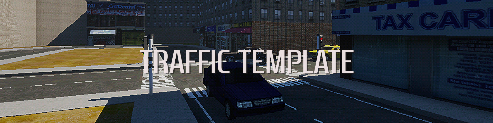
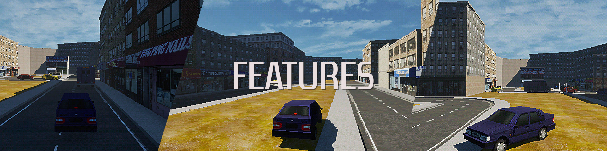

# Vehicle & Traffic System Template (Unreal Engine)

## Overview

A modular traffic and vehicle simulation template built for **open-world Unreal Engine projects**.
This system focuses on clean C++ architecture and extensibility suitable for prototyping or full production environments.

This template provides functional ground vehicles, simple crash physics, and AI-driven traffic using Unreal’s MassAI framework.
It is intentionally designed for optimized, lightweight, and retro-style projects, making it ideal for PS1-inspired games, stylized worlds, or simple open-world prototypes.
While not intended for high-fidelity simulation or complex vehicle dynamics, it offers a clean and extensible foundation for projects that prioritize performance, scalability, and straightforward implementation.

---

## Features

### **Vehicle Physics**

* Fully functional drivable vehicles
* Acceleration, braking, and steering
* Configurable handling parameters
* C++-based movement logic for consistency & expandability

### **Crash Physics**

* Simple collision reactions using a mesh deformation plugin
* Lightweight deformation suitable for gameplay (not simulation-grade)

### **Traffic AI (MassAI)**

* AI road vehicles powered by Unreal’s MassAI system
* Dynamic traffic flow
* Configurable behavior parameters
* Easily placeable and optimized for open worlds

### **Modular System Design**

* Add new vehicles with minimal setup
* Extend traffic patterns or logic cleanly
* Designed for scalability in large maps or dense city environments

---

## How to Extend the Template

* Create new vehicle classes or data-driven setups
* Add custom driving behavior, sensors, or traffic rules
* Modify or expand MassAI processors for more realistic AI logic
* Integrate with open-world streaming or navigation systems

---

## Planned Updates / Roadmap

* Smarter AI lane switching, overtaking, and traffic rules
* Pedestrian support (MassAI)

---

## Development Status

This project is under **active development**, with ongoing improvements to systems, physics, AI behavior, and overall usability.
A public download will be released once all placeholder or copyrighted assets from external packs are replaced and the project receives further polish.

## Contact

- **https://anastasismarinos.com**

---
